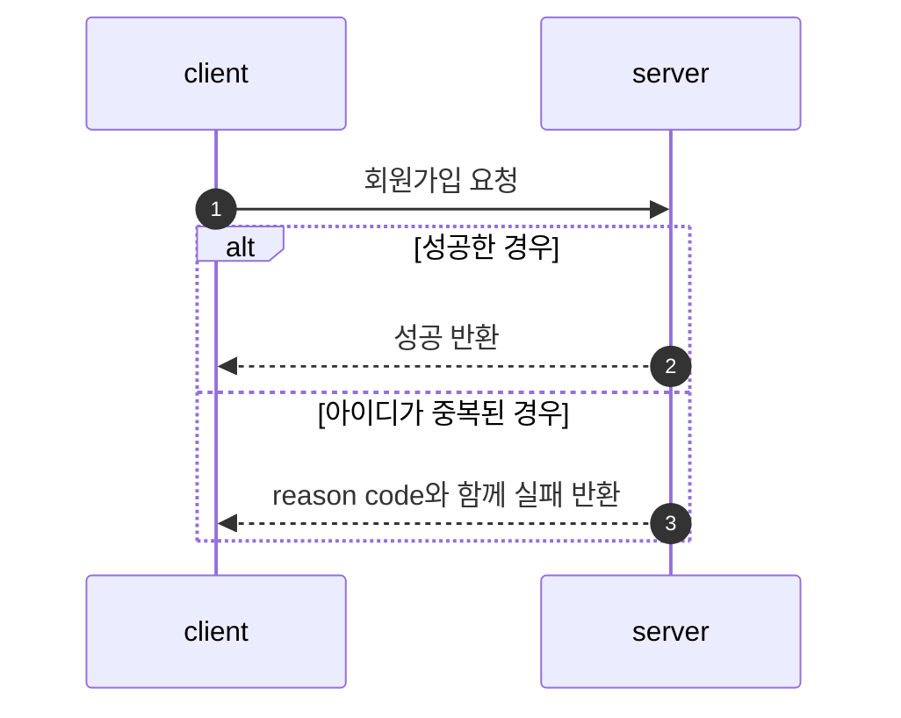
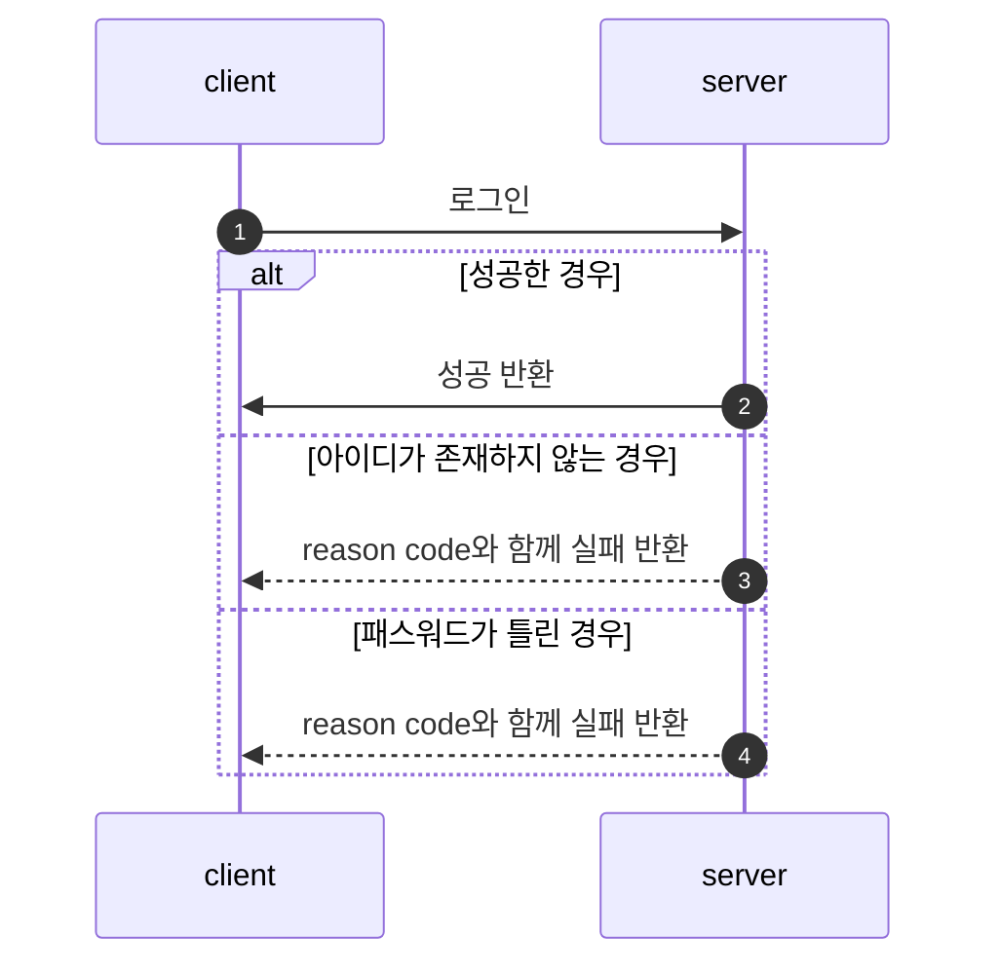
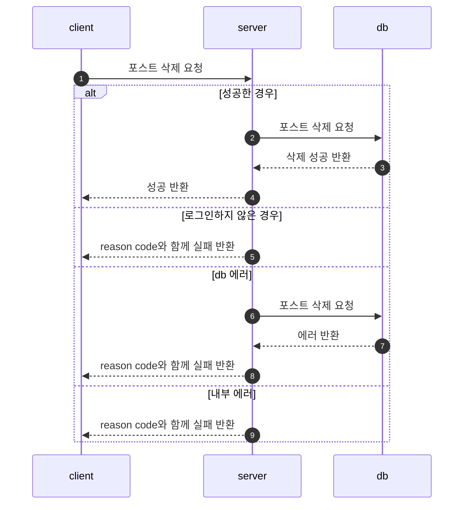
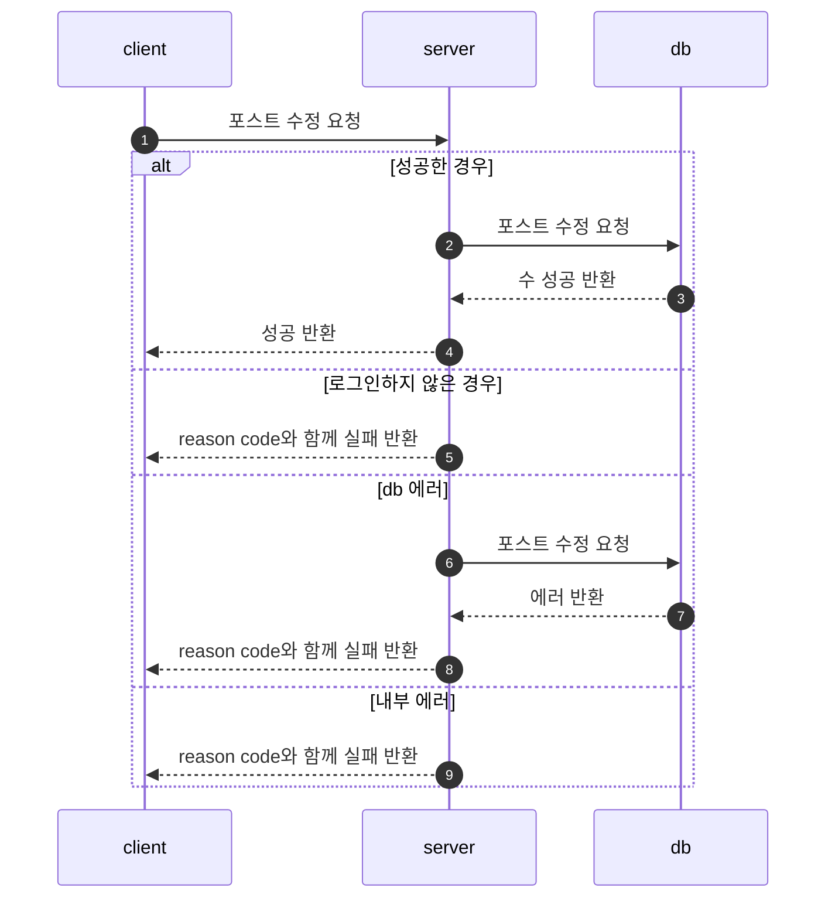
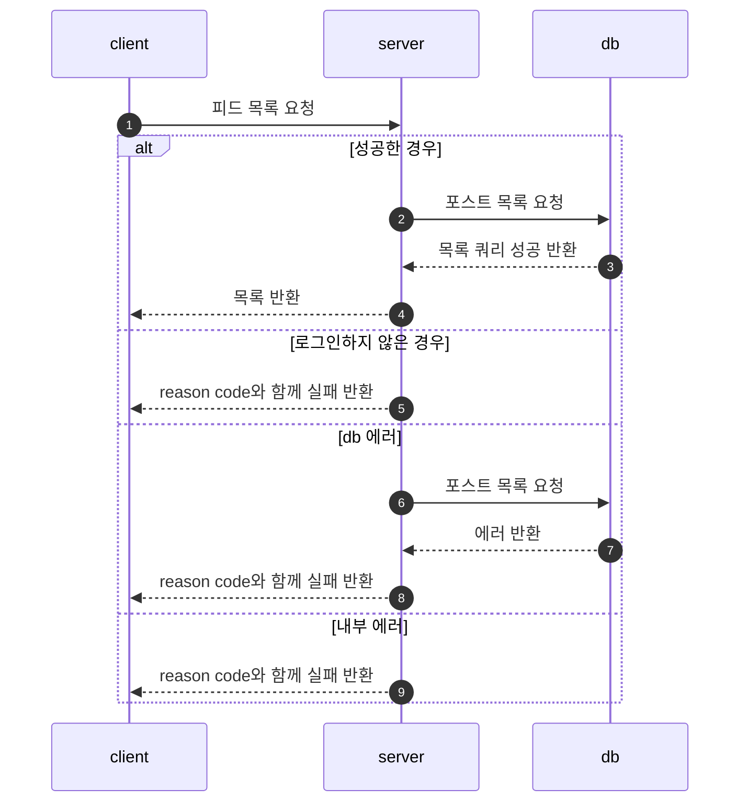
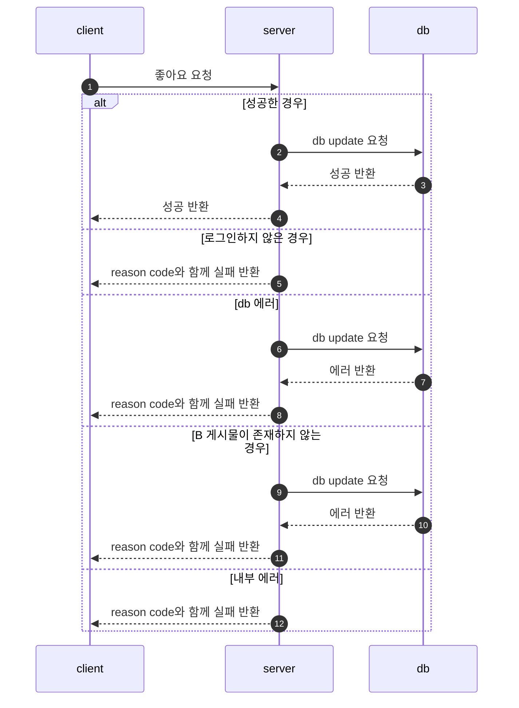
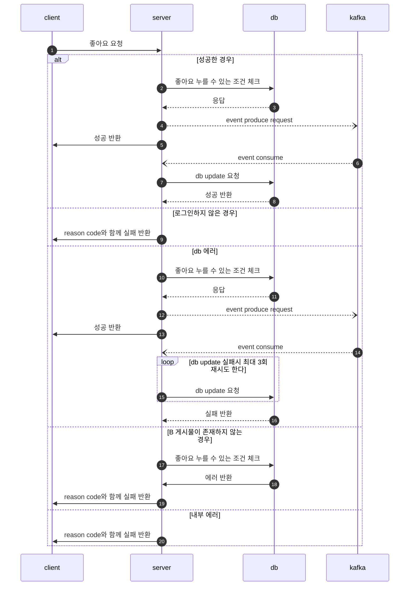
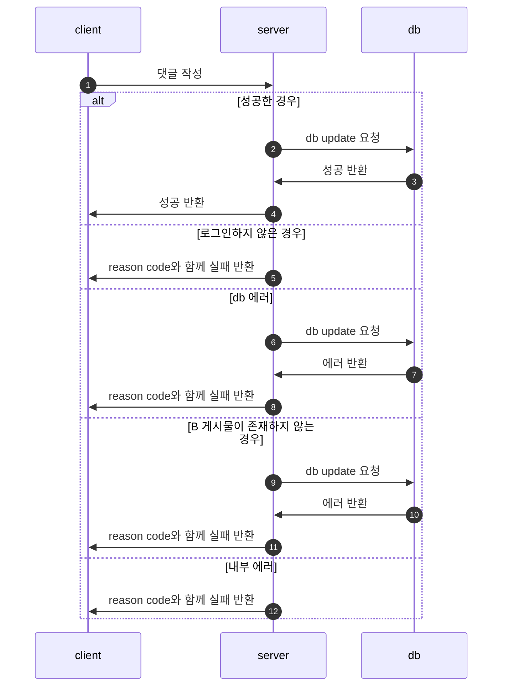
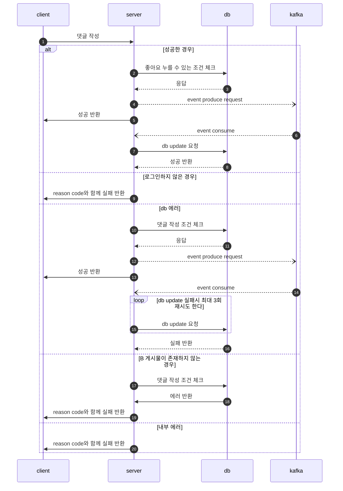
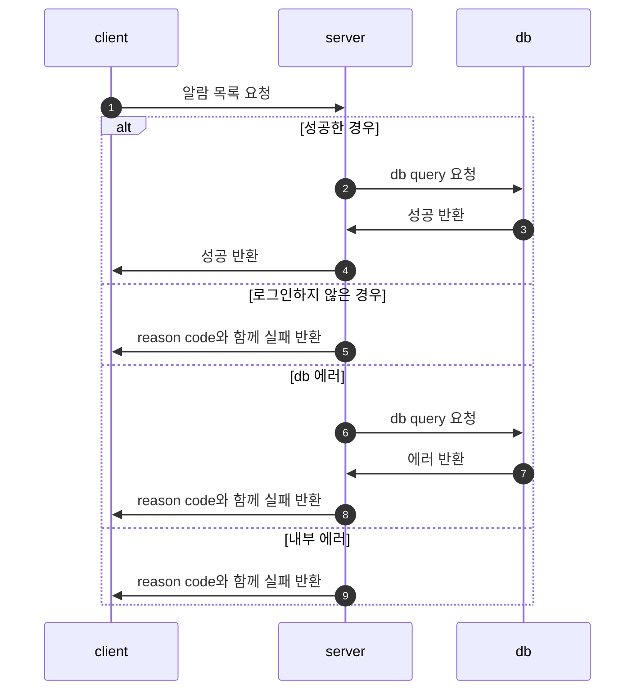

# SNS 포트폴리오 (소셜 네트워크 서비스)

게시글, 댓글, 좋아요, 실시간 알림 기능을 갖춘 소셜 네트워크 서비스. Kafka와 SSE를 활용한 실시간 이벤트 처리를 지원합니다.

---

## 프로젝트 소개

Spring Boot 기반의 SNS 백엔드 서비스로, 게시글 CRUD, 댓글, 좋아요 기능과 함께 Kafka + SSE를 활용한 실시간 알림 시스템을 구현했습니다. Spring Boot 2.6에서 **3.2.5로 업그레이드**하여 javax에서 jakarta 네임스페이스로 전환하고, SecurityFilterChain 기반의 최신 보안 설정을 적용했습니다.

---

## Application Architecture


---

## 기술 스택

| 구분 | 기술 | 버전 |
|------|------|------|
| 언어 | Java | 17 |
| 프레임워크 | Spring Boot | 3.2.5 |
| 데이터베이스 | PostgreSQL | - |
| 캐시 | Redis (Lettuce) | - |
| 메시지 브로커 | Kafka | - |
| 인증 | JWT (jjwt) | 0.11.5 |
| ORM | Spring Data JPA | - |
| 프론트엔드 | React (Gradle 통합 빌드) | - |
| 빌드 | Gradle | - |

---

## 주요 기능

| 기능 | 설명 |
|------|------|
| **게시글 CRUD** | 작성, 조회, 수정, 삭제 (Soft Delete) |
| **댓글** | 게시글에 대한 댓글 작성/삭제 |
| **좋아요** | 좋아요/취소 (중복 방지, COUNT 쿼리 최적화) |
| **실시간 알림** | SSE + Kafka 기반 알림 (댓글, 좋아요 이벤트) |
| **회원가입/로그인** | JWT 기반 인증, BCrypt 비밀번호 암호화 |
| **Soft Delete** | `@SQLDelete` + `@Where` 자동 필터링 |

### 최근 변경사항 (Boot 2.6 -> 3.2.5 업그레이드)

- `javax.*` -> `jakarta.*` 네임스페이스 전환
- `WebSecurityConfigurerAdapter` -> `SecurityFilterChain` 전환
- JDK 17 마이그레이션

---

## 빠른 시작

### 사전 요구사항

- JDK 17+
- PostgreSQL
- Redis
- Kafka

### 설치 및 실행

```bash
# 프로젝트 클론
git clone https://github.com/MyoungSoo7/sns-portfolio.git
cd sns-portfolio

# 실행
./gradlew bootRun
```

---

## 프로젝트 구조

```
├── controller/         # REST 컨트롤러
├── service/            # 비즈니스 로직
├── model/
│   ├── entity/         # JPA 엔티티
│   └── domain/         # 도메인 객체
├── repository/
│   ├── JPA/            # JPA 리포지토리
│   └── Redis cache/    # Redis 캐시 리포지토리
├── configuration/      # 설정 (Security, Kafka, Redis 등)
├── producer/           # Kafka 프로듀서
├── consumer/           # Kafka 컨슈머
├── exception/          # 예외 처리
└── utils/              # 유틸리티 (JWT 등)
```

---

## 성능 최적화

| 항목 | 설정 |
|------|------|
| HikariCP 커넥션 풀 | 15 |
| `batch_fetch_size` | 30 |
| `open-in-view` | false |
| GZip 압축 | 활성화 |
| DB 인덱스 | post, comment, like 테이블 |
| `getLikeCount` | COUNT 쿼리 최적화 |
| SSE Emitter 관리 | ConcurrentHashMap 기반 |

---

## 보안

| 항목 | 구현 |
|------|------|
| JWT | 만료기간 7일 |
| 비밀번호 | BCrypt 암호화 |
| 세션 정책 | Stateless |
| 인증 실패 | 커스텀 AuthenticationEntryPoint |
| 개발 전용 | `@Profile("dev")` DevController |

---

## 이벤트 처리

| 구분 | 설명 |
|------|------|
| **Kafka** | 댓글, 좋아요 발생 시 알림 이벤트 발행 |
| **SSE** | Server-Sent Events 실시간 알림 푸시 |
| **EmitterRepository** | ConcurrentHashMap 기반 SSE Emitter 관리 |
| **재시도** | Kafka consume 실패 시 최대 3회 재시도 |

---

## CI/CD

GitHub Actions를 통한 자동화 파이프라인 (JDK 17):

- Gradle 빌드
- 테스트 실행
- 코드 품질 검사

---

## 문서 목록

| 문서 | 경로 |
|------|------|
| 기능 명세서 | [`docs/functional-spec.md`](docs/functional-spec.md) |
| 사용자 매뉴얼 | [`docs/manual.md`](docs/manual.md) |
| 업무 프로세스 정의서 | [`docs/process-definition.md`](docs/process-definition.md) |
| 화면 설계서 | [`docs/screen-design.md`](docs/screen-design.md) |
| 시퀀스 다이어그램 | [`docs/sequence-diagram.md`](docs/sequence-diagram.md) |
| 테스트 리포트 | [`docs/test-report.md`](docs/test-report.md) |
| 문제 해결 가이드 | [`docs/troubleshooting.md`](docs/troubleshooting.md) |

---

## 테스트

5개 테스트 클래스, 15건 이상의 테스트 케이스:

```bash
./gradlew test
```

- 게시글 CRUD 테스트
- 댓글 기능 테스트
- 좋아요 중복 방지 테스트
- Kafka 이벤트 발행/소비 테스트
- JWT 인증 테스트

---

## Flow Chart

<details>
<summary>상세 Flow Chart 보기 (클릭하여 펼치기)</summary>

### 1. 회원가입



### 2. 로그인



### 3. 포스트 작성


### 4. 포스트 삭제



### 5. 포스트 수정



### 6. 피드 목록



### 7. 좋아요 기능 (Kafka 적용 전/후)

**적용 전:**



**적용 후:**



### 8. 댓글 기능 (Kafka 적용 전/후)

**적용 전:**



**적용 후:**



### 9. 알람 기능



</details>

---

## 라이선스

이 프로젝트는 학습 목적으로 제작되었습니다.
