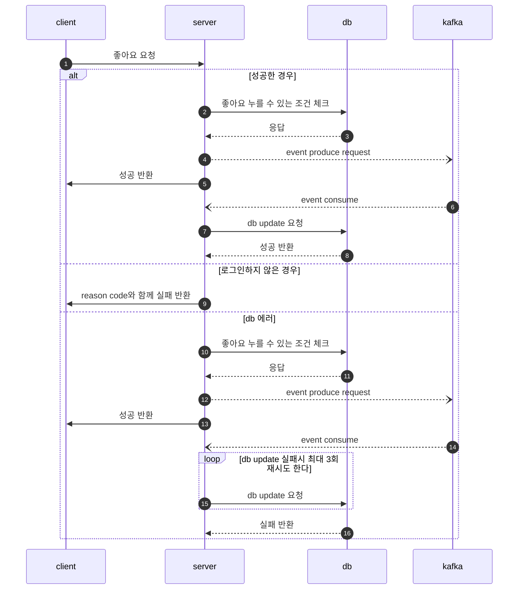

# SNS 포트폴리오 - 소셜 네트워크 서비스

게시글, 댓글, 좋아요, 실시간 알림 기능을 갖춘 소셜 네트워크 서비스

## 프로젝트 소개

Spring Boot 기반의 SNS 백엔드 서비스입니다. 게시글 CRUD, 댓글, 좋아요 기능과 함께 Kafka + SSE를 활용한 실시간 알림 시스템을 구현했습니다. Kafka 기반 비동기 이벤트 처리로 좋아요/댓글 발생 시 실시간 알림을 전달합니다.

---

## 기술 스택

| 구분 | 기술 | 버전 |
|------|------|------|
| Backend | Java + Spring Boot + JPA | 25 / 4.0.4 |
| Database | PostgreSQL | - |
| Cache | Redis (Lettuce) | - |
| 메시지 브로커 | Kafka | - |
| 인증 | JWT (jjwt) | 0.11.5 |
| Frontend | React (Gradle 통합 빌드) | - |
| Build | Gradle | - |

---

## 주요 기능

| 기능 | 설명 |
|------|------|
| **게시글 CRUD** | 작성, 조회, 수정, 삭제 (Soft Delete) |
| **댓글** | 게시글에 대한 댓글 작성/삭제 |
| **좋아요** | 좋아요/취소 (중복 방지, COUNT 쿼리 최적화) |
| **실시간 알림** | SSE + Kafka 기반 알림 (댓글, 좋아요 이벤트) |
| **회원가입/로그인** | JWT 기반 인증, BCrypt 비밀번호 암호화 |
| **Soft Delete** | `@SQLDelete` + `@Where` 자동 필터링 |

---

## 아키텍처


### 이벤트 처리

```
[좋아요/댓글 요청] -> [조건 체크] -> [Kafka 이벤트 발행] -> [응답 반환]
                                          |
                                    [Kafka 컨슈머] -> [DB 업데이트] -> [SSE 알림 전송]
                                          |
                                    (실패 시 최대 3회 재시도)
```

---

## 빠른 시작

### 사전 요구사항

- JDK 25+
- PostgreSQL, Redis, Kafka

### 실행

```bash
git clone https://github.com/MyoungSoo7/sns-portfolio.git
cd sns-portfolio
./gradlew bootRun
```

---

## 프로젝트 구조

```
sns-portfolio/
├── controller/         # REST 컨트롤러
├── service/            # 비즈니스 로직
├── model/
│   ├── entity/         # JPA 엔티티
│   └── domain/         # 도메인 객체
├── repository/
│   ├── JPA/            # JPA 리포지토리
│   └── Redis cache/    # Redis 캐시 리포지토리
├── configuration/      # Security, Kafka, Redis 설정
├── producer/           # Kafka 프로듀서
├── consumer/           # Kafka 컨슈머
├── exception/          # 예외 처리
└── utils/              # JWT 유틸리티
```

---

## 성능 최적화

| 항목 | 설정 |
|------|------|
| HikariCP 커넥션 풀 | 15 |
| `batch_fetch_size` | 30 |
| `open-in-view` | false |
| GZip 압축 | 활성화 |
| DB 인덱스 | post, comment, like 테이블 |
| SSE Emitter | ConcurrentHashMap 기반 관리 |

---

## 보안

| 항목 | 구현 |
|------|------|
| JWT 인증 (만료 7일) | O |
| BCrypt 비밀번호 암호화 | O |
| Stateless 세션 정책 | O |
| 커스텀 AuthenticationEntryPoint | O |

---

## 테스트

5개 테스트 클래스, 15건 이상의 테스트 케이스:

```bash
./gradlew test
```

---

## 문서

| 문서 | 경로 |
|------|------|
| 기능 명세서 | [`docs/functional-spec.md`](docs/functional-spec.md) |
| 시퀀스 다이어그램 | [`docs/sequence-diagram.md`](docs/sequence-diagram.md) |
| 테스트 리포트 | [`docs/test-report.md`](docs/test-report.md) |
| 문제 해결 가이드 | [`docs/troubleshooting.md`](docs/troubleshooting.md) |

<details>
<summary>상세 Flow Chart (클릭하여 펼치기)</summary>

### 좋아요 기능 (Kafka 적용 후)



</details>

---

## 라이선스

이 프로젝트는 학습 목적으로 제작되었습니다.
