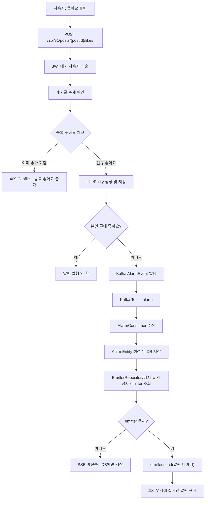
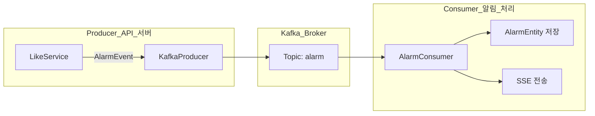
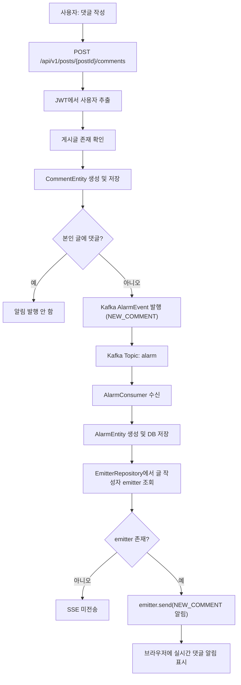
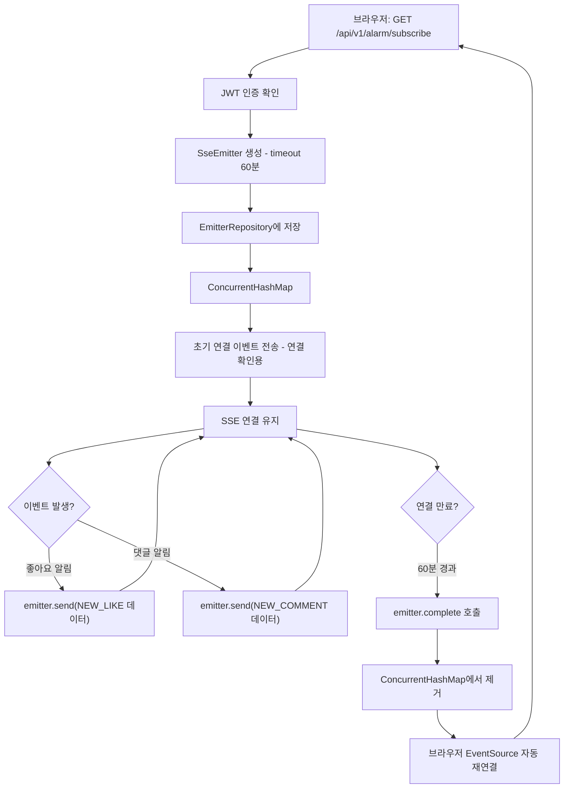
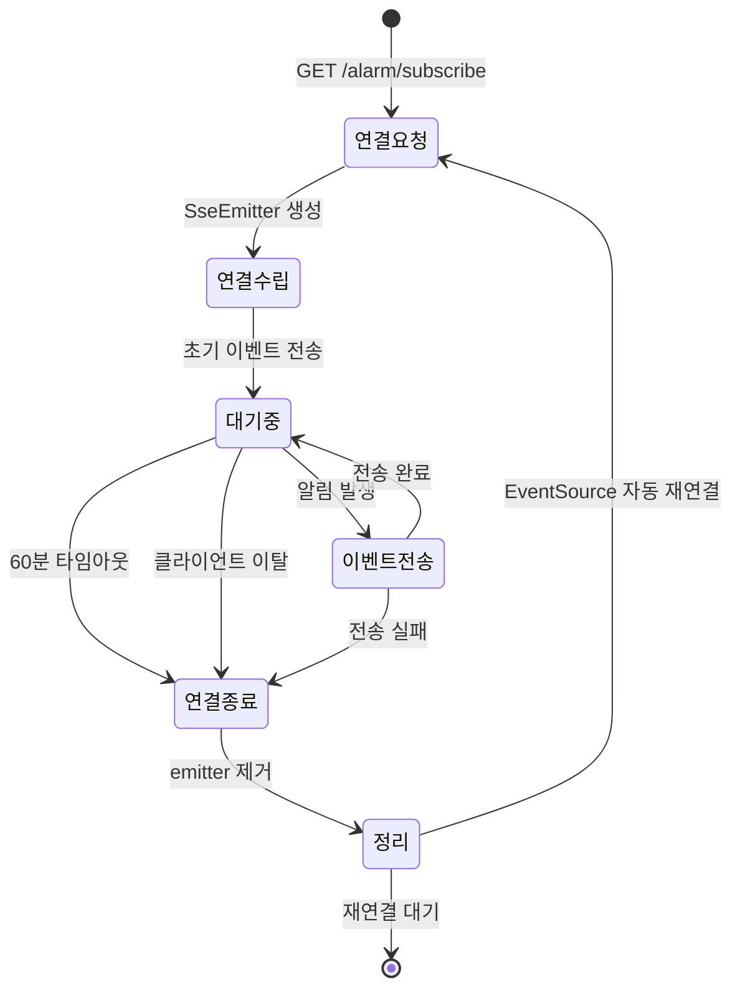
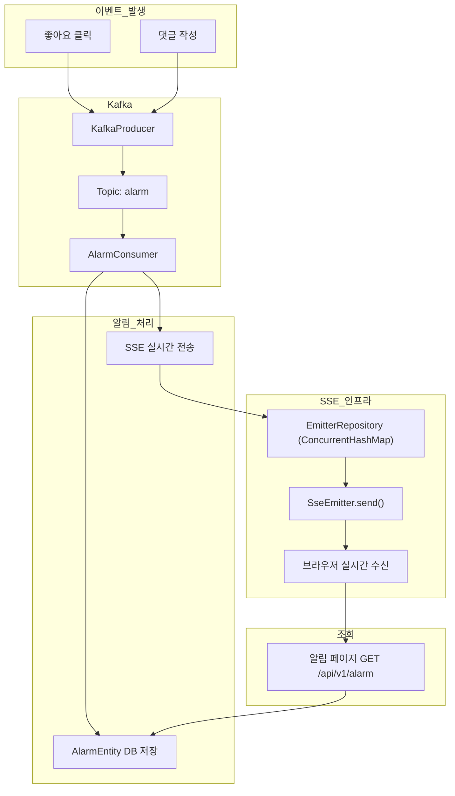

# 프로세스정의서 — SNS 포트폴리오

## 1. 게시글 CRUD 프로세스

### 1.1 프로세스 개요

| 항목 | 내용 |
|------|------|
| 프로세스명 | 게시글 CRUD 프로세스 |
| 트리거 | 사용자의 게시글 작성/조회/수정/삭제 요청 |
| 입력 | 제목, 본문 (작성/수정), 게시글 ID (조회/수정/삭제) |
| 출력 | 게시글 생성/수정/삭제 결과 |
| 관련 API | `/api/v1/posts` |

### 1.2 프로세스 흐름도

```mermaid
flowchart TD
    subgraph 작성_Create
        A1[사용자: 제목/본문 입력] --> B1["POST /api/v1/posts"]
        B1 --> C1[JWT 토큰에서 사용자 추출]
        C1 --> D1[PostEntity 생성 및 저장]
        D1 --> E1[성공 응답 반환]
    end

    subgraph 조회_Read
        A2["GET /api/v1/posts"] --> B2[Pageable로 전체 목록 조회]
        B2 --> C2[PostEntity → PostDto 변환]
        C2 --> D2[페이지네이션 응답]
    end

    subgraph 수정_Update
        A3["사용자: 수정 요청"] --> B3["PUT /api/v1/posts/{id}"]
        B3 --> C3[게시글 존재 확인]
        C3 --> D3{소유자 검증}
        D3 -->|불일치| E3[403 Forbidden - 본인 글만 수정 가능]
        D3 -->|일치| F3[제목/본문 업데이트]
        F3 --> G3[성공 응답]
    end

    subgraph 삭제_Delete
        A4["사용자: 삭제 요청"] --> B4["DELETE /api/v1/posts/{id}"]
        B4 --> C4[게시글 존재 확인]
        C4 --> D4{소유자 검증}
        D4 -->|불일치| E4[403 Forbidden]
        D4 -->|일치| F4[Soft Delete 처리]
        F4 --> G4[연관 좋아요 Soft Delete]
        G4 --> H4[연관 댓글 Soft Delete]
        H4 --> I4[연관 알림 Soft Delete]
        I4 --> J4[성공 응답]
    end
```

### 1.3 상세 처리 규칙

| 단계 | 처리 내용 | 비고 |
|------|-----------|------|
| 인증 | JWT 토큰에서 userName 추출 후 UserEntity 조회 | `@AuthenticationPrincipal` 사용 |
| 소유자 검증 | `post.getUser().equals(currentUser)` | 불일치 시 403 반환 |
| Soft Delete | `deletedAt` 필드에 현재 시간 설정 | 물리 삭제 아님 |
| 연쇄 삭제 | 좋아요 → 댓글 → 알림 순서로 Soft Delete | 데이터 정합성 유지 |
| 페이지네이션 | `Pageable(page, size, sort=createdAt,desc)` | 기본 20건 |

---

## 2. 좋아요 + 알림 프로세스

### 2.1 프로세스 개요

| 항목 | 내용 |
|------|------|
| 프로세스명 | 좋아요 + 알림 프로세스 |
| 트리거 | 사용자가 게시글의 좋아요 버튼 클릭 |
| 입력 | 게시글 ID |
| 출력 | LikeEntity 저장 + 글 작성자에게 실시간 알림 |
| 관련 기술 | Kafka, SSE |

### 2.2 프로세스 흐름도

### 2.3 상세 처리 규칙

| 단계 | 처리 내용 | 비고 |
|------|-----------|------|
| 중복 체크 | `LikeRepository.findByUserAndPost(user, post)` | 존재 시 409 반환 |
| LikeEntity | user, post 연관관계 | `@ManyToOne` |
| Kafka 발행 | Topic: `alarm`, Key: postId, Value: AlarmEvent(NEW_LIKE, targetUserId, fromUserId, postId) | 비동기 처리 |
| AlarmEntity | alarmType=NEW_LIKE, user(글 작성자), args(좋아요 누른 사용자, 게시글 ID) | DB 영구 저장 |
| SSE 전송 | `SseEmitter.send(SseEventBuilder)` | 실시간 푸시 |

### 2.4 Kafka 이벤트 흐름

---

## 3. 댓글 + 알림 프로세스

### 3.1 프로세스 개요

| 항목 | 내용 |
|------|------|
| 프로세스명 | 댓글 + 알림 프로세스 |
| 트리거 | 사용자가 게시글에 댓글 작성 |
| 입력 | 게시글 ID, 댓글 내용 |
| 출력 | CommentEntity 저장 + 글 작성자에게 실시간 알림 |
| 관련 기술 | Kafka, SSE |

### 3.2 프로세스 흐름도

### 3.3 상세 처리 규칙

| 단계 | 처리 내용 | 비고 |
|------|-----------|------|
| CommentEntity | user(작성자), post(게시글), comment(내용) | `@ManyToOne` 양방향 |
| Kafka 발행 | AlarmEvent(NEW_COMMENT, targetUserId, fromUserId, postId) | 좋아요와 동일 Topic 사용 |
| 알림 메시지 | "{사용자명}님이 댓글을 남겼습니다" | alarmType으로 메시지 포맷 결정 |
| 자기 댓글 | 본인 글에 댓글 시 알림 미발행 | 불필요한 알림 방지 |

---

## 4. SSE 구독 프로세스

### 4.1 프로세스 개요

| 항목 | 내용 |
|------|------|
| 프로세스명 | SSE(Server-Sent Events) 구독 프로세스 |
| 트리거 | 사용자가 서비스 접속 (프론트엔드 EventSource 연결) |
| 입력 | 인증된 사용자 정보 |
| 출력 | 실시간 알림 스트림 |
| 관련 기술 | SseEmitter, ConcurrentHashMap |

### 4.2 프로세스 흐름도

### 4.3 상세 처리 규칙

| 단계 | 처리 내용 | 비고 |
|------|-----------|------|
| SseEmitter 생성 | `new SseEmitter(3600000L)` — 60분 타임아웃 | Spring MVC 기본 제공 |
| 저장소 | `ConcurrentHashMap<String, SseEmitter>` | 스레드 안전, 인메모리 |
| 초기 이벤트 | 연결 직후 더미 이벤트 전송 | 503 에러 방지 (빈 스트림 방지) |
| 이벤트 전송 | `emitter.send(SseEmitter.event().name("alarm").data(alarmData))` | JSON 형식 |
| 만료 처리 | `onCompletion`, `onTimeout` 콜백에서 Map 제거 | 메모리 누수 방지 |
| 에러 처리 | 전송 실패 시 해당 emitter 제거 | 클라이언트 이탈 대응 |

### 4.4 SSE 상태 다이어그램

### 4.5 전체 알림 아키텍처

