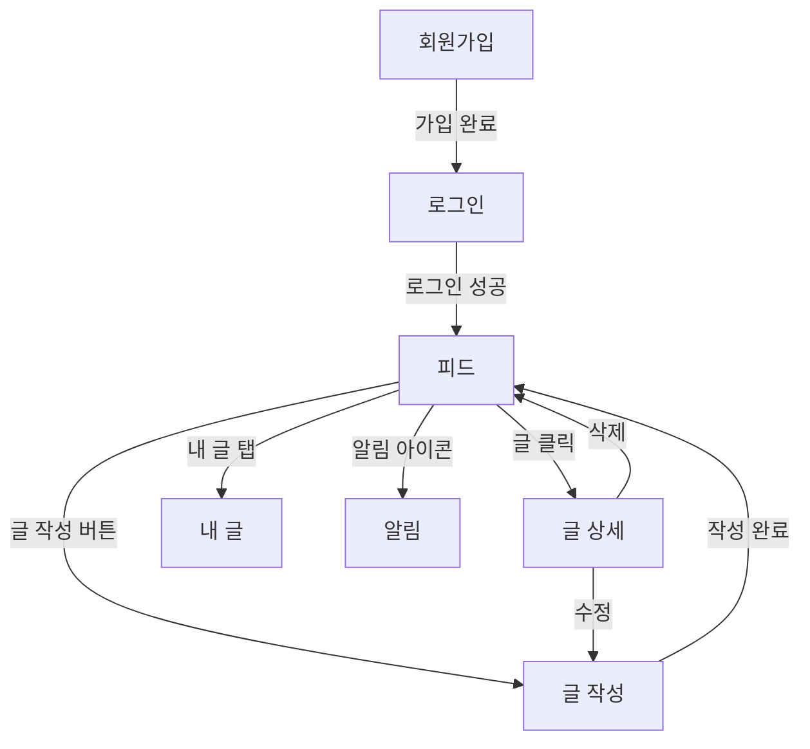
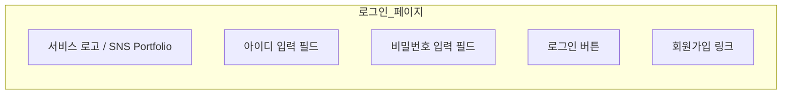
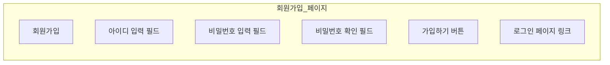
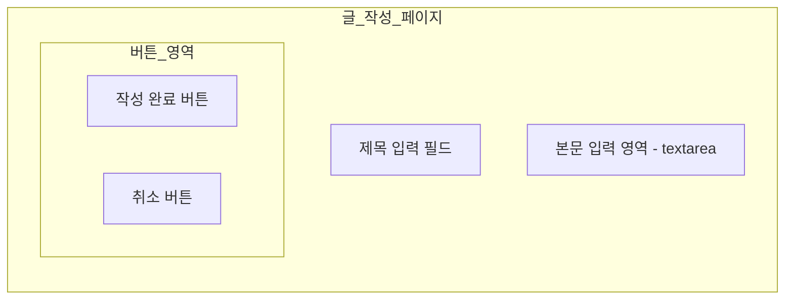
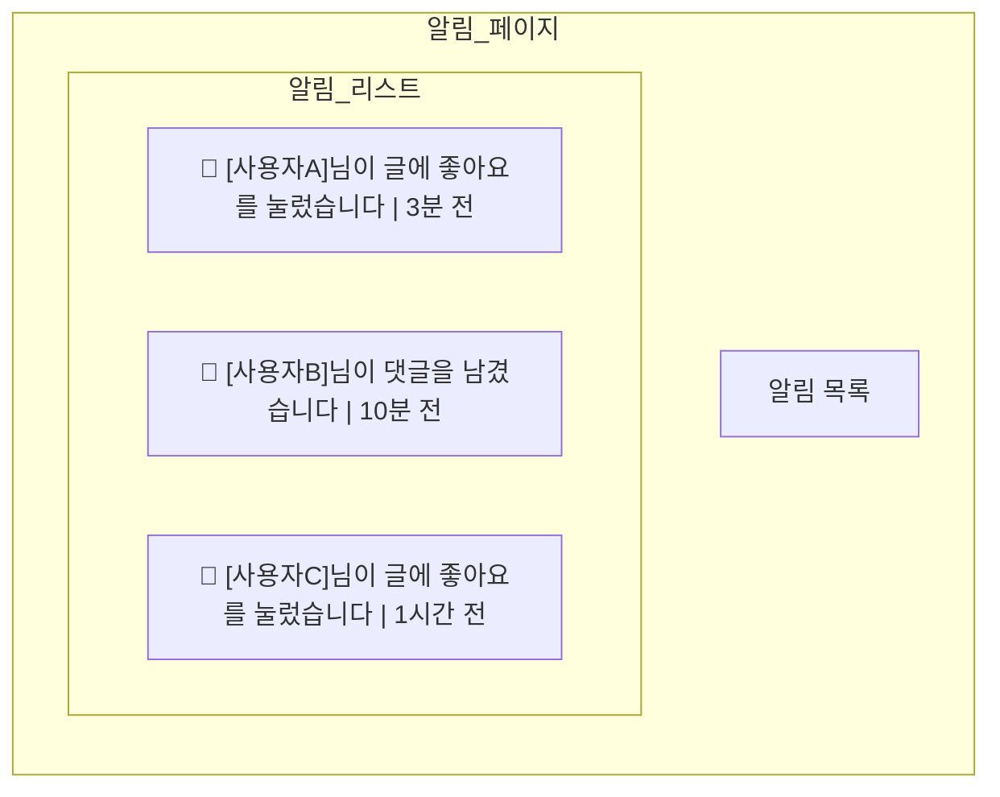
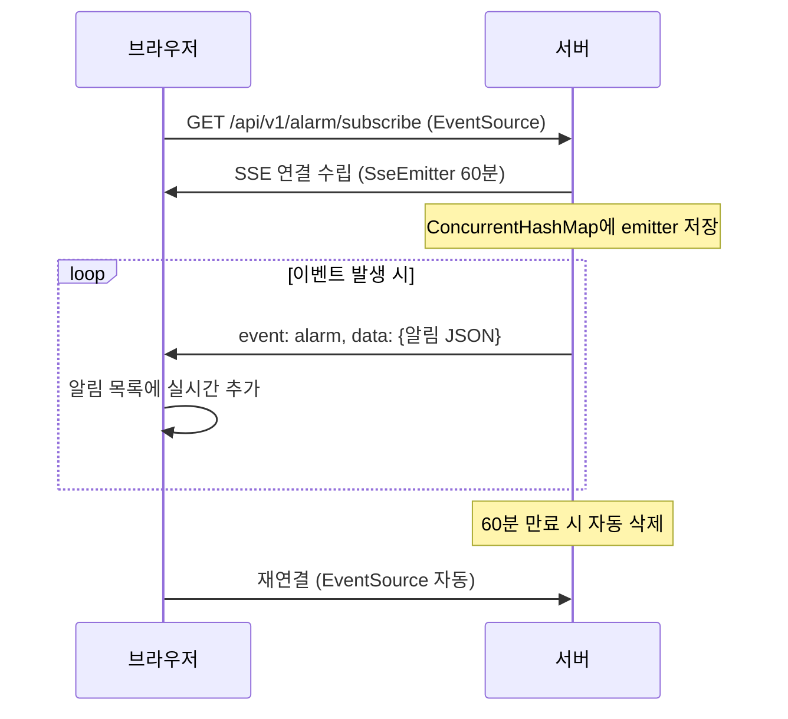
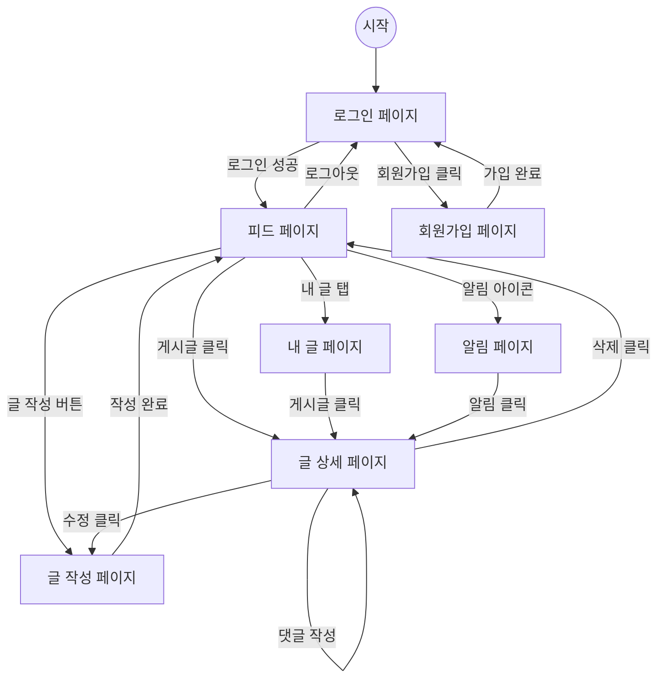
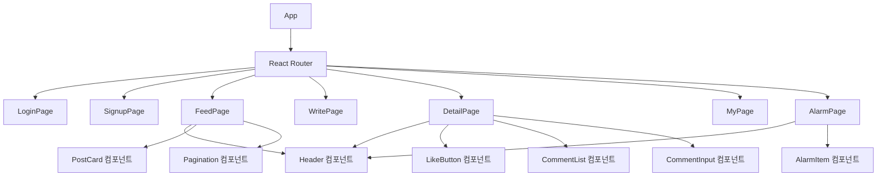

# 화면설계서 — SNS 포트폴리오

## 1. 전체 화면 구조



---

## 2. 페이지별 화면 설계

### 2.1 로그인 페이지

- **프레임워크**: React SPA
- **라우트**: `/login`



| 요소 | 타입 | 설명 |
|------|------|------|
| 아이디 | `input[text]` | 필수, placeholder: "아이디를 입력하세요" |
| 비밀번호 | `input[password]` | 필수, placeholder: "비밀번호를 입력하세요" |
| 로그인 버튼 | `button` | `POST /api/v1/users/login` — JWT 토큰 발급 |
| 회원가입 링크 | `Link` | `/signup` 라우트 이동 |
| 에러 메시지 | `div.error` | 로그인 실패 시 "아이디 또는 비밀번호가 올바르지 않습니다" 표시 |

---

### 2.2 회원가입 페이지

- **라우트**: `/signup`



| 요소 | 타입 | 설명 |
|------|------|------|
| 아이디 | `input[text]` | 필수, 중복 검사 |
| 비밀번호 | `input[password]` | 필수 |
| 비밀번호 확인 | `input[password]` | 비밀번호 일치 여부 검증 |
| 가입하기 | `button` | `POST /api/v1/users/join` |
| 로그인 링크 | `Link` | `/login` 라우트 이동 |

---

### 2.3 피드 페이지

- **라우트**: `/` (메인)
- **데이터 로딩**: 무한 스크롤 또는 페이지네이션

```mermaid
graph TB
    subgraph 피드_페이지
        direction TB
        subgraph 헤더
            LOGO[로고] --- NAV[내 글 | 알림 아이콘 - 뱃지 | 로그아웃]
        end
        WRITE_BTN[글 작성 버튼]
        subgraph 게시글_목록
            POST1[작성자 | 제목 | 본문 미리보기 | 좋아요 수 | 댓글 수 | 작성일]
            POST2[작성자 | 제목 | 본문 미리보기 | 좋아요 수 | 댓글 수 | 작성일]
            POST3[...]
        end
        PAGINATION[페이지네이션 또는 무한 스크롤 로딩]
    end
```

| 요소 | 타입 | 설명 |
|------|------|------|
| 글 작성 버튼 | `button` | `/write` 라우트 이동 |
| 게시글 카드 | `div.card` | 클릭 시 `/post/{id}` 상세 페이지 이동 |
| 좋아요 수 | `span` | 해당 글의 전체 좋아요 카운트 |
| 댓글 수 | `span` | 해당 글의 전체 댓글 카운트 |
| 알림 아이콘 | `button` | 뱃지로 미확인 알림 수 표시, 클릭 시 `/alarm` 이동 |
| 페이지네이션 | `Pageable` | `GET /api/v1/posts?page={page}&size=20` |

---

### 2.4 글 작성 페이지

- **라우트**: `/write`



| 요소 | 타입 | 설명 |
|------|------|------|
| 제목 | `input[text]` | 필수, 최대 255자 |
| 본문 | `textarea` | 필수 |
| 작성 완료 | `button` | `POST /api/v1/posts` — 성공 시 피드로 이동 |
| 취소 | `button` | 이전 페이지로 이동 (history.back) |

---

### 2.5 글 상세 페이지

- **라우트**: `/post/{id}`

```mermaid
graph TB
    subgraph 글_상세_페이지
        direction TB
        subgraph 본문_영역
            TITLE[게시글 제목]
            AUTHOR[작성자 | 작성일]
            BODY[본문 내용]
            subgraph 액션_버튼
                LIKE["좋아요 버튼 ♥ (카운트)"]
                EDIT[수정 버튼 - 본인만 표시]
                DELETE[삭제 버튼 - 본인만 표시]
            end
        end
        subgraph 댓글_영역
            COMMENT_INPUT[댓글 입력 필드 + 등록 버튼]
            COMMENT_LIST[댓글 목록]
            C1[작성자 | 댓글 내용 | 작성일]
            C2[작성자 | 댓글 내용 | 작성일]
        end
    end
```

| 요소 | 타입 | 설명 |
|------|------|------|
| 제목 | `h1` | 게시글 제목 |
| 작성자/작성일 | `span` | 작성자명, 날짜 포맷(yyyy-MM-dd HH:mm) |
| 본문 | `div` | 게시글 본문 전체 |
| 좋아요 버튼 | `button` | `POST /api/v1/posts/{id}/likes` — 토글 방식 아님, 1회 등록 |
| 좋아요 카운트 | `span` | 현재 좋아요 수 실시간 반영 |
| 수정 버튼 | `button` | 본인 글만 표시, `/write?edit={id}` 이동 |
| 삭제 버튼 | `button` | 본인 글만 표시, `DELETE /api/v1/posts/{id}` 확인 후 실행 |
| 댓글 입력 | `input[text]` + `button` | `POST /api/v1/posts/{id}/comments` |
| 댓글 목록 | `div.comment-list` | 작성일 순 정렬 |

---

### 2.6 내 글 페이지

- **라우트**: `/my`

```mermaid
graph TB
    subgraph 내_글_페이지
        direction TB
        TITLE[내가 작성한 글]
        subgraph 게시글_목록
            POST1[제목 | 좋아요 수 | 댓글 수 | 작성일]
            POST2[제목 | 좋아요 수 | 댓글 수 | 작성일]
        end
        PAGINATION[페이지네이션]
    end
```

| 요소 | 타입 | 설명 |
|------|------|------|
| 게시글 목록 | `table` 또는 `div.list` | `GET /api/v1/posts/my?page={page}` |
| 게시글 행 | 클릭 가능 | `/post/{id}` 상세 페이지 이동 |
| 페이지네이션 | `nav` | 본인 글만 필터링된 결과 |

---

### 2.7 알림 페이지

- **라우트**: `/alarm`
- **실시간 통신**: SSE (Server-Sent Events)



| 요소 | 타입 | 설명 |
|------|------|------|
| 알림 항목 | `div.alarm-item` | 알림 타입(NEW_COMMENT, NEW_LIKE) + 발생자 + 시간 |
| 실시간 수신 | `EventSource` | `GET /api/v1/alarm/subscribe` — SSE 연결 |
| 알림 타입 표시 | `badge` | 댓글 알림 / 좋아요 알림 구분 표시 |
| 시간 표시 | `span` | 상대 시간 (n분 전, n시간 전) |
| 게시글 링크 | `a` | 알림 클릭 시 해당 게시글로 이동 |

#### SSE 연결 흐름



---

## 3. 화면 흐름도 (전체)



---

## 4. 컴포넌트 구조 (React)


