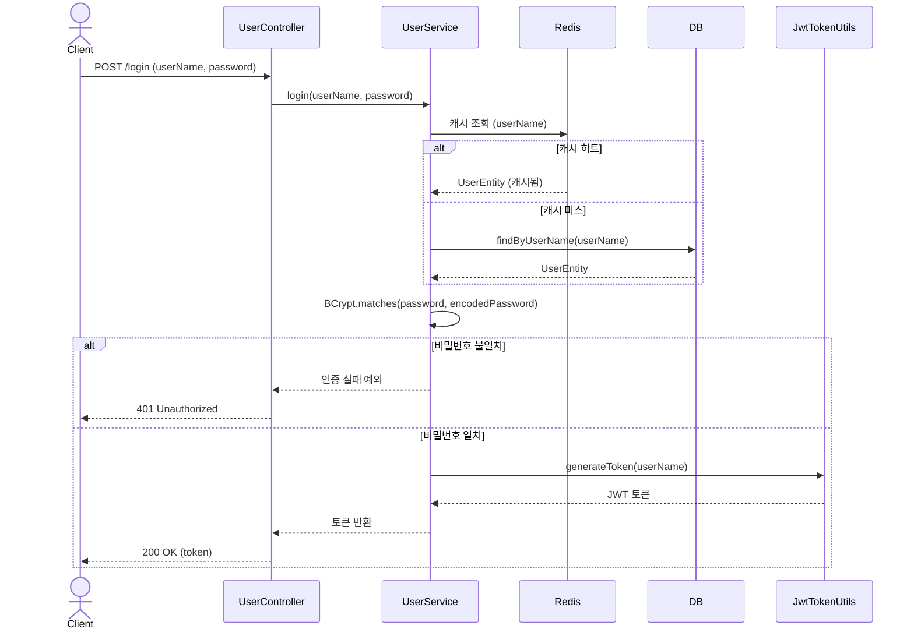
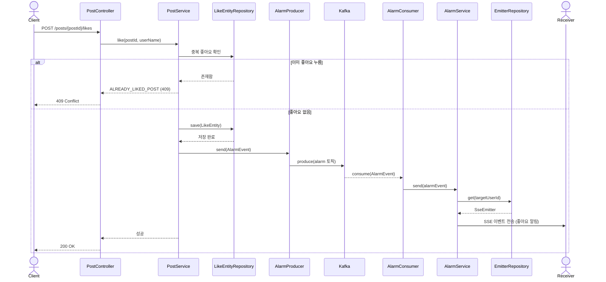
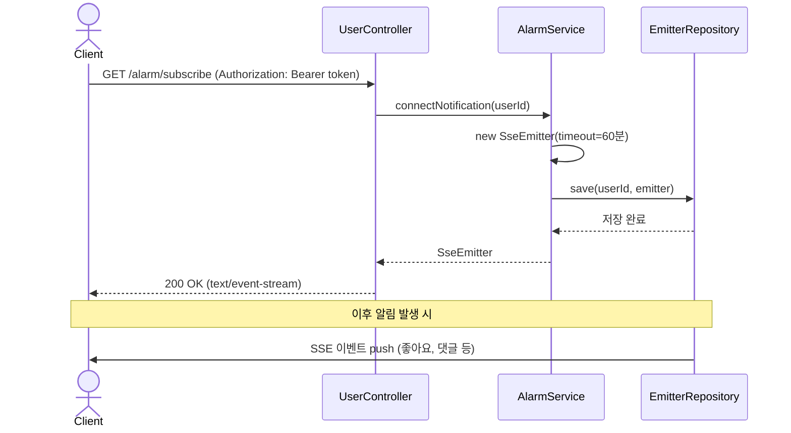
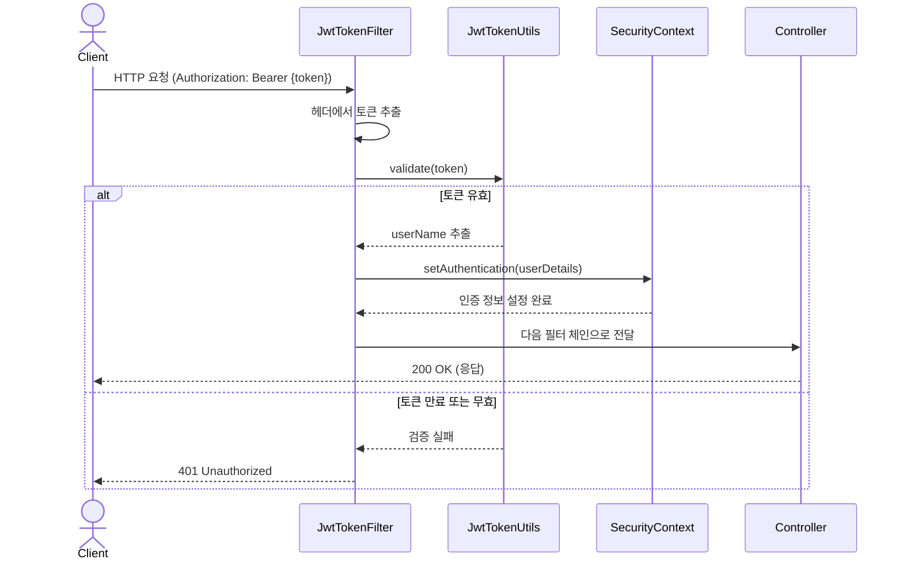

# 시퀀스 다이어그램

## 1. 로그인 플로우

```mermaid
sequenceDiagram
    actor Client
    participant UC as UserController
    participant US as UserService
    participant Redis
    participant DB
    participant JWT as JwtTokenUtils

    Client->>UC: POST /login (userName, password)
    UC->>US: login(userName, password)
    US->>Redis: 캐시 조회 (userName)
    alt 캐시 히트
        Redis-->>US: UserEntity (캐시됨)
    else 캐시 미스
        US->>DB: findByUserName(userName)
        DB-->>US: UserEntity
    end
    US->>US: BCrypt.matches(password, encodedPassword)
    alt 비밀번호 불일치
        US-->>UC: 인증 실패 예외
        UC-->>Client: 401 Unauthorized
    else 비밀번호 일치
        US->>JWT: generateToken(userName)
        JWT-->>US: JWT 토큰
        US-->>UC: 토큰 반환
        UC-->>Client: 200 OK (token)
    end
```

## 2. 게시글 좋아요 + 알림

```mermaid
sequenceDiagram
    actor Client
    participant PC as PostController
    participant PS as PostService
    participant LR as LikeEntityRepository
    participant AP as AlarmProducer
    participant Kafka
    participant AC as AlarmConsumer
    participant AS as AlarmService
    participant ER as EmitterRepository
    actor Receiver

    Client->>PC: POST /posts/{postId}/likes
    PC->>PS: like(postId, userName)
    PS->>LR: 중복 좋아요 확인
    alt 이미 좋아요 누름
        LR-->>PS: 존재함
        PS-->>PC: ALREADY_LIKED_POST (409)
        PC-->>Client: 409 Conflict
    else 좋아요 없음
        PS->>LR: save(LikeEntity)
        LR-->>PS: 저장 완료
        PS->>AP: send(AlarmEvent)
        AP->>Kafka: produce(alarm 토픽)
        Kafka-->>AC: consume(AlarmEvent)
        AC->>AS: send(alarmEvent)
        AS->>ER: get(targetUserId)
        ER-->>AS: SseEmitter
        AS->>Receiver: SSE 이벤트 전송 (좋아요 알림)
        PS-->>PC: 성공
        PC-->>Client: 200 OK
    end
```

## 3. SSE 알림 구독

```mermaid
sequenceDiagram
    actor Client
    participant UC as UserController
    participant AS as AlarmService
    participant ER as EmitterRepository

    Client->>UC: GET /alarm/subscribe (Authorization: Bearer token)
    UC->>AS: connectNotification(userId)
    AS->>AS: new SseEmitter(timeout=60분)
    AS->>ER: save(userId, emitter)
    ER-->>AS: 저장 완료
    AS-->>UC: SseEmitter
    UC-->>Client: 200 OK (text/event-stream)

    Note over Client,ER: 이후 알림 발생 시
    ER->>Client: SSE 이벤트 push (좋아요, 댓글 등)
```

## 4. 토큰 인증 (JWT 필터)

```mermaid
sequenceDiagram
    actor Client
    participant JTF as JwtTokenFilter
    participant JWT as JwtTokenUtils
    participant SC as SecurityContext
    participant Ctrl as Controller

    Client->>JTF: HTTP 요청 (Authorization: Bearer {token})
    JTF->>JTF: 헤더에서 토큰 추출
    JTF->>JWT: validate(token)
    alt 토큰 유효
        JWT-->>JTF: userName 추출
        JTF->>SC: setAuthentication(userDetails)
        SC-->>JTF: 인증 정보 설정 완료
        JTF->>Ctrl: 다음 필터 체인으로 전달
        Ctrl-->>Client: 200 OK (응답)
    else 토큰 만료 또는 무효
        JWT-->>JTF: 검증 실패
        JTF-->>Client: 401 Unauthorized
    end
```
